## 歐巴馬競選網站主視覺實驗 

<h3>如何優化會員註冊率？</h3>

     
  

    
  

  
<h3>Original trial</h3>

   
  

    
  

  
<h3>Family trial</h3>

---
## 歐巴馬競選網站主視覺實驗 - 原始資料 (示意)

  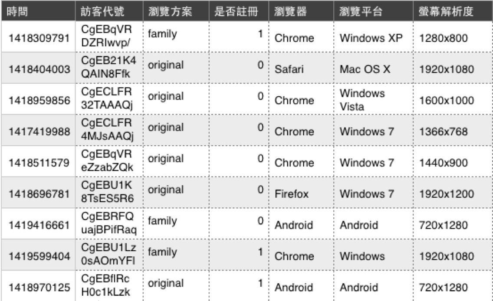

---
## 歐巴馬競選網站主視覺實驗 - 實驗結果

  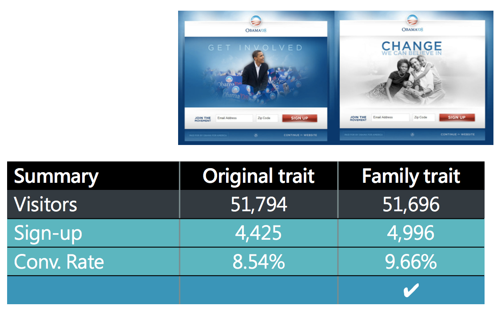

*** =note

這裡是實驗的差距

實際上線後照比率估計則是6000萬美元的差距

Reference: <https://blog.optimizely.com/2010/11/29/how-obama-raised-60-million-by-running-a-simple-experiment/>

--- &vcenter .largecontent
## 關於A/B Testing
- 何謂AB測試?
- AB測試如何運作?
- AB測試為什麼該做？

--- &vcenter
## 何謂AB測試
 

  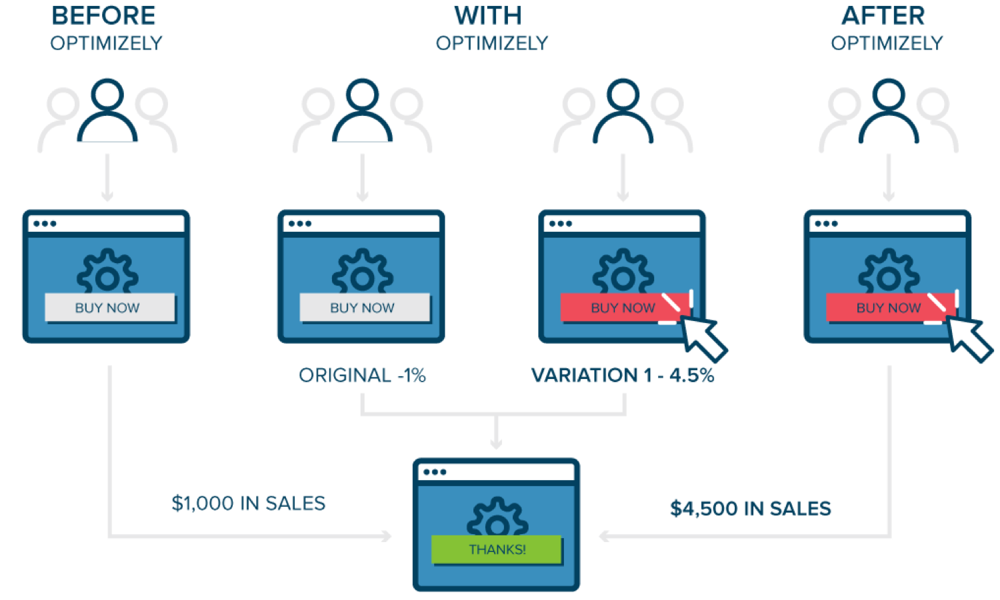

<small>www.optimizely.com</small>

--- &vcenter
## AB測試如何運作
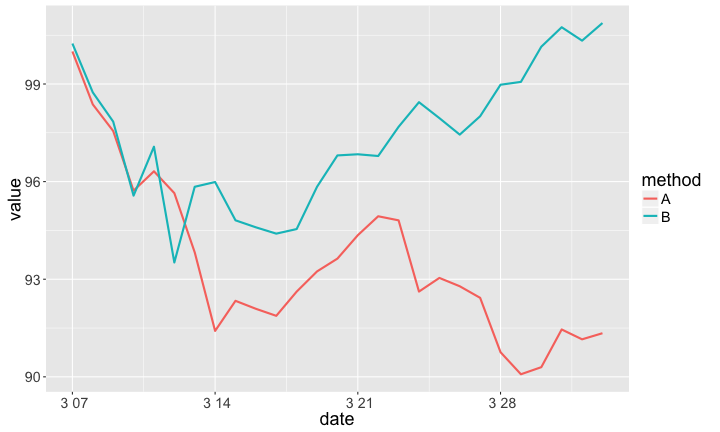

---&vcenter .largecontent
## AB測試為什麼該做
- 免窮理：don't necessarily know 'what works'
- 講證據：don't guess anymore
- 很簡單：don't have to be complicated or difficult to run
- 更經濟：don't have to cost a lot of money

--- &vcenter .largecontent
## AB測試基本原則
 

  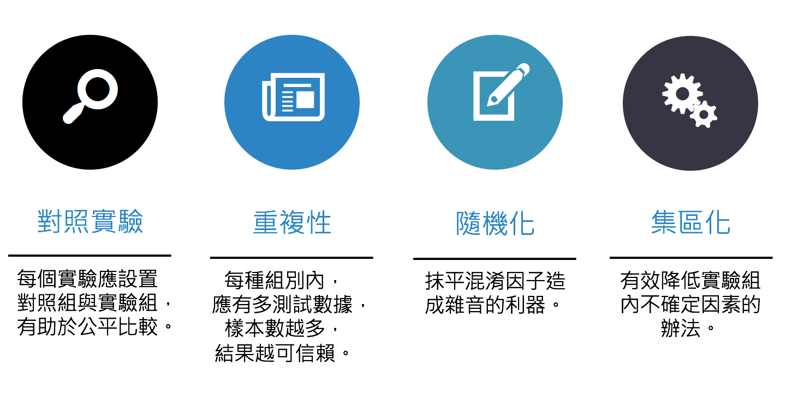

--- &vcenter .largecontent
## 如何證明「烏鴉都是黑的」(Hempel 1945)
這個假設不會因為看見一隻黑色的烏鴉而獲得證明,    
不管看到多少隻黑色的烏鴉,都無法證明這個假設。

  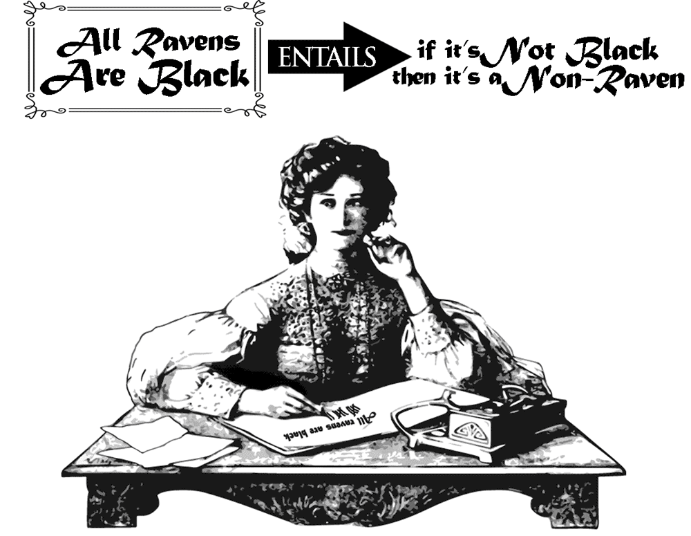

--- .largecontent
## 假設檢定的觀念 (testing hypothesis)
引進機率的概念,以「絕大部份」取代「所有」。    
假設黑烏鴉跟其他顏色的烏鴉比例是 99 : 1,    
你已經觀察到1000隻黑色烏鴉了, 在99:1的假設下,連續看到1000隻黑色烏鴉的機率是0.99^1000 = 0.00043,這個機率稱 p值。

  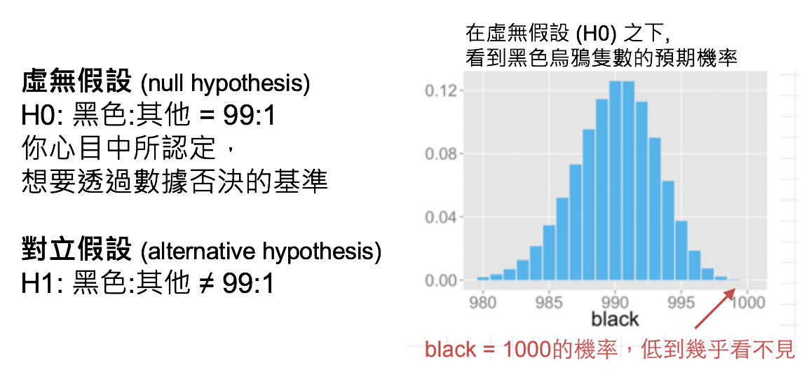

--- &vcenter .largecontent
## 檢定統計量(Ｔ值)
 

  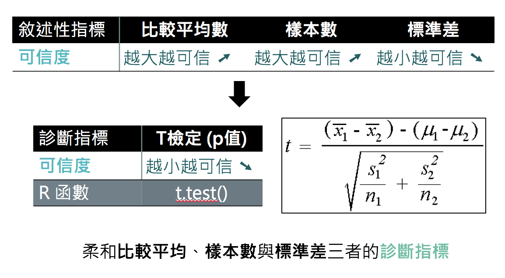

--- &vcenter
## T統計量與P值

  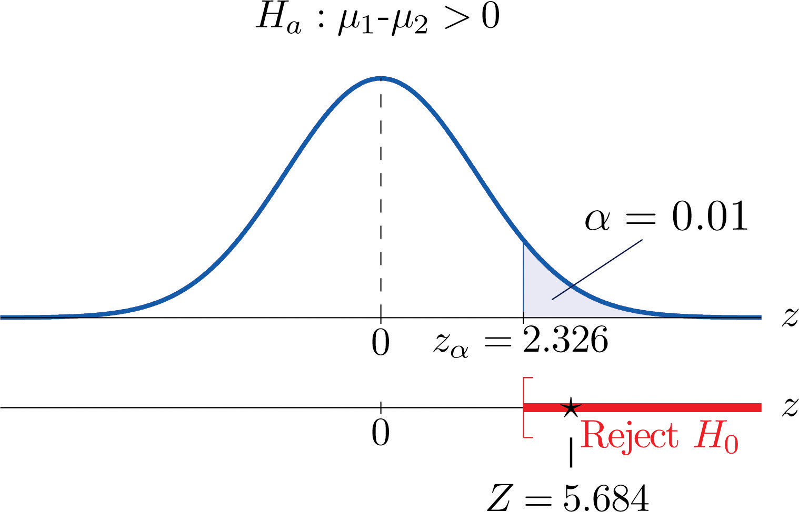

<small>http://goo.gl/PrlGsd</small>

--- .dark .segue
## 更多實務案例

--- .dark .segue
## 商品陳列也有A/B Testing

---
## 陳列畫面影響商品價值實驗 

<h3>情境1. 用來裝飾房間的中國結</h3>
<small>http://goo.gl/qxijE8</small>

     
  

    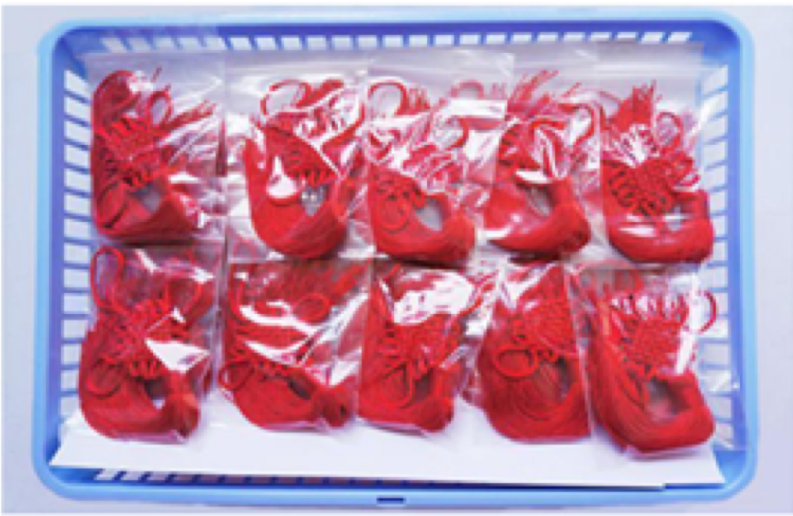
  

  
<h3>整齊的中國結</h3>

   
  

    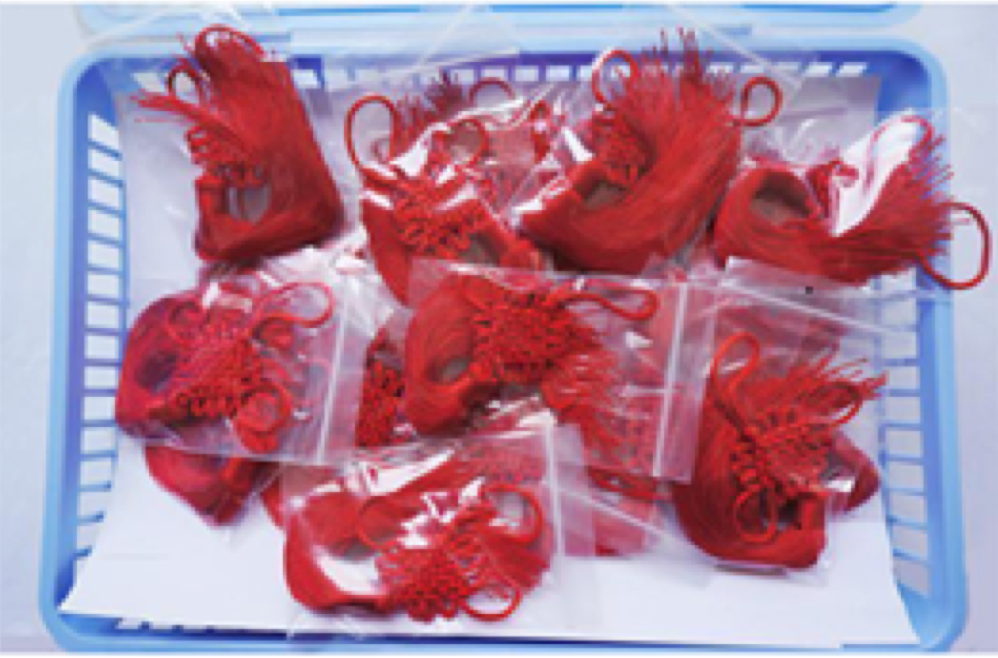
  

  
<h3>凌亂的中國結</h3>

--- 
## 陳列畫面影響商品價值實驗 

<h3>情境2. 用來做課堂拆解練習的中國結</h3>
<small>http://goo.gl/qxijE8</small>

     
  

    
  

  
<h3>整齊的中國結</h3>

   
  

    
  

  
<h3>凌亂的中國結</h3>

--- .dark .segue
## 提升慈善捐款的A/B Testing

--- &vcenter
## 哪種策略更能刺激捐款？

  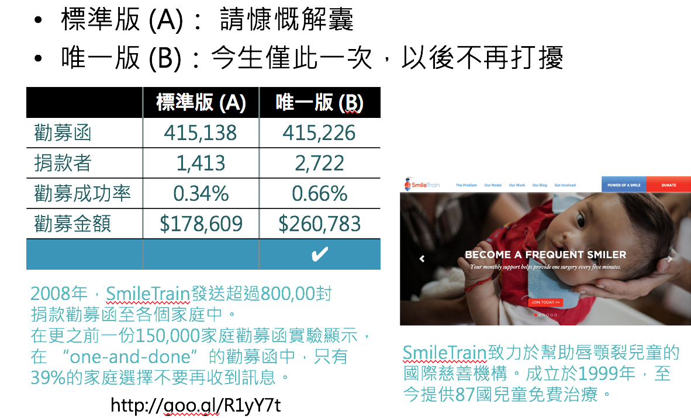

--- .dark .segue
## 幫助法院討債的A/B Testing

---
## 討債簡訊如信寫？

  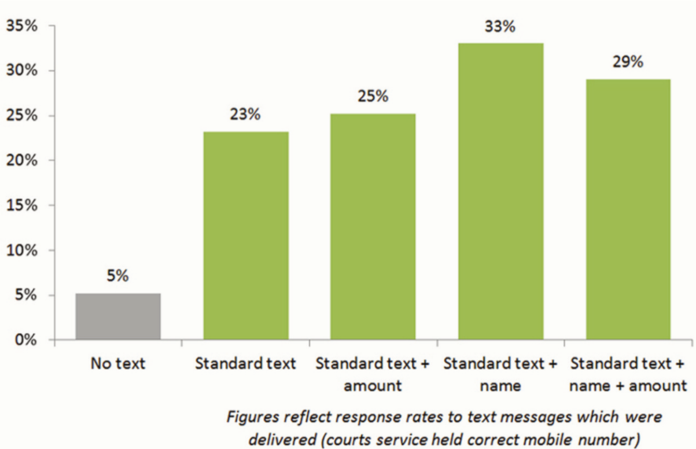
  <small>https://goo.gl/yMe9jO</small>

--- &vcenter .largecontent
## Advanced A/B Testing
- 檢定水準
- 樣本數 / 測試時程
- 多重檢定
- 統計顯著 vs. 物理顯著 (商業顯著)
