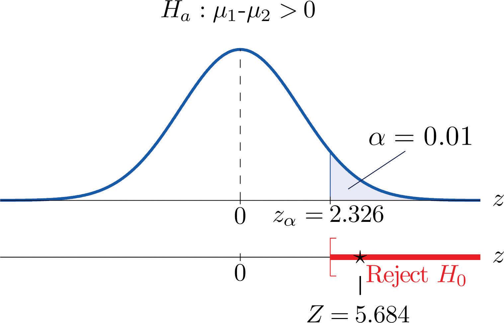
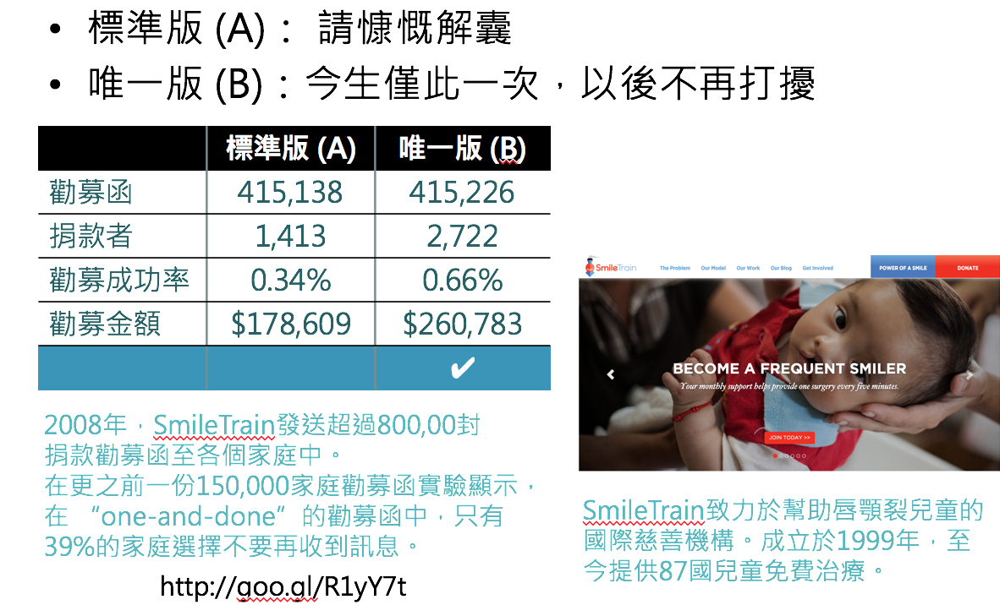

## 歐巴馬競選網站主視覺實驗 
<div style='text-align: center;'>
<h3>如何優化會員註冊率？</h3>
</div>
<div style="float:left;width:48%;" class="">
  <br>  
  <div style='text-align: center;'>
    
  </div>
  <div style='text-align: center;'><h3>Original trial</h3></div>

</div>
<div style="float:right;width:48%;" class="">
  <br>
  <div style='text-align: center;'>
    
  </div>
  <div style='text-align: center;'><h3>Family trial</h3></div>
</div>

---

## 歐巴馬競選網站主視覺實驗 - 原始資料 (示意)
<div style='text-align: center;'>
  
<div>

---

## 歐巴馬競選網站主視覺實驗 - 實驗結果
<div style='text-align: center;'>
  
<div>

*** =pnotes

這裡是實驗的差距

實際上線後照比率估計則是6000萬美元的差距

Reference: <https://blog.optimizely.com/2010/11/29/how-obama-raised-60-million-by-running-a-simple-experiment/>

--- &vcenter .largecontent

## 關於A/B Testing
- 何謂AB測試?
- AB測試如何運作?
- AB測試為什麼該做？

--- &vcenter

## 何謂AB測試
<br>
<div style='text-align: center;'>
  
</div>
<small>www.optimizely.com</small>

--- &vcenter

## AB測試如何運作
```{r abt-value}
library(ggplot2)
# AA test
set.seed(1)
x1 <- c(100, rnorm(6, -1, sd=1))
cx1 <- cumsum(x1)
cy1 <- cx1 + rnorm(7, 0, sd=0.5)

# AB test
x2 <- rnorm(20, -0.2, sd=1)
cx2 <- cumsum(c(x1,x2))
y2 <- rnorm(20, 0.2, sd=1)
cy2 <- c(cy1[-6], cumsum(c(cy1[6], y2)))

date <- seq.Date(from=as.Date("2016-03-07"), length.out = 27, by="day")
dat <- data.frame(method=rep(c("A","B"), each=27), 
           date=as.Date(rep(date,2)),
           value=c(cx2, cy2),
           cvalue=c(cumsum(cx2), cumsum(cy2)))
ggplot(dat, aes(x=date, y=value, color=method)) + 
  geom_line(lwd=1) +
  theme(text=element_text(size=18))
```

---&vcenter .largecontent

## AB測試為什麼該做
- 免窮理：don't necessarily know 'what works'
- 講證據：don't guess anymore
- 很簡單：don't have to be complicated or difficult to run
- 更經濟：don't have to cost a lot of money

--- &vcenter .largecontent

## AB測試基本原則
<br>
<div style='text-align: center;'>
  
</div>

--- &vcenter .largecontent

## 如何證明「烏鴉都是黑的」(Hempel 1945)

這個假設不會因為看見一隻黑色的烏鴉而獲得證明,    
不管看到多少隻黑色的烏鴉,都無法證明這個假設。
<div style='text-align: center;'>
  
</div>

--- &vcenter .largecontent

## 與犯錯妥協

<center>`r fig("accept-mistake.jpg", 100)`</center>
<small><http://www.jhak.com/shidian/xqgw/2014-02/14/content_9397.html></small>

--- &vcenter .largecontent

## 處理犯錯

- 控制犯錯的機率
    - 「事前」決定接受5%、1%或更小的犯錯機率
- 計算「出現觀測值（或更糟）的機率」
    - 「更糟」的定義取決於假設與檢定目標
- 如果機率值比我們設定的犯錯機率更低 => 表示當初的假設是錯誤的

```{r testing2, fig.width = 10, fig.height = 4}
curve(dnorm(x), -3, 3, xlab = "", ylab = "", main = "Model", ylim = c(-0.05, 0.4), lwd = 3)
lines(c(-3, 3), c(0, 0), lwd = 3)
.x <- seq(2.1, 3, by = 0.01)
polygon(c(.x, rev(.x)), c(dnorm(.x), rep(0, length(.x))), col = rgb(1, 0, 0, 0.3))
arrows(x0 = 2.1, y0 = -0.05, y1 = 0, lwd = 3)
text(2.1, -0.035, "observation", pos = 2)
```

--- .largecontent

## 假設檢定的觀念 (testing hypothesis)

引進機率的概念,以「絕大部份」取代「所有」。    
假設黑烏鴉跟其他顏色的烏鴉比例是 99 : 1,    
你已經觀察到1000隻黑色烏鴉了, 在99:1的假設下,連續看到1000隻黑色烏鴉的機率是$0.99^{1000} < 0.0001$,這個機率稱 p值。
<div style='text-align: center;'>
  
</div>

--- &vcenter .largecontent

## 檢定統計量(Ｔ值)
<br>
<div style='text-align: center;'>
  
</div>

--- &vcenter

## T統計量與P值
<div style='text-align: center;'>
  
</div>
<small>http://goo.gl/PrlGsd</small>

--- &vcenter .largecontent

## 假設檢定的限制

- 只能證明$H_0$為假, 不能證明$H_1$為真
    - 當不拒絕時，不代表$H_1$為錯

--- .dark .segue

## 更多實務案例

--- .dark .segue

## 商品陳列也有A/B Testing

---

## 陳列畫面影響商品價值實驗 
<div style='text-align: center;'>
<h3>情境1. 用來裝飾房間的中國結</h3>
<small>http://goo.gl/qxijE8</small>
</div>
<div style="float:left;width:48%;" class="">
  <br>  
  <div style='text-align: center;'>
    
  </div>
  <div style='text-align: center;'><h3>整齊的中國結</h3></div>

</div>
<div style="float:right;width:48%;" class="">
  <br>
  <div style='text-align: center;'>
    
  </div>
  <div style='text-align: center;'><h3>凌亂的中國結</h3></div>
</div>

---

## 陳列畫面影響商品價值實驗 
<div style='text-align: center;'>
<h3>情境2. 用來做課堂拆解練習的中國結</h3>
<small>http://goo.gl/qxijE8</small>
</div>
<div style="float:left;width:48%;" class="">
  <br>  
  <div style='text-align: center;'>
    
  </div>
  <div style='text-align: center;'><h3>整齊的中國結</h3></div>

</div>
<div style="float:right;width:48%;" class="">
  <br>
  <div style='text-align: center;'>
    
  </div>
  <div style='text-align: center;'><h3>凌亂的中國結</h3></div>
</div>

--- .dark .segue

## 提升慈善捐款的A/B Testing

--- &vcenter

## 哪種策略更能刺激捐款？
<div style='text-align: center;'>
  
</div>

--- .dark .segue

## 幫助法院討債的A/B Testing

---

## 討債簡訊如信寫？
<div style='text-align: center;'>
  
  <small>https://goo.gl/yMe9jO</small>
</div>

--- &vcenter .largecontent

## 練習時間

- 請同學跟著老師完成：
    - RStatistics-02-MonteCarlo
    - RStatistics-03-AB-Testing

--- .dark .segue

## A/B Test 不只這樣...

--- &vcenter .largecontent

## 實驗的成本

- 時間成本（實驗要多久？）
- 金錢成本（要多少樣本？）

--- &vcenter .largecontent

## 多重檢定

- 提早結束條款會影響準確度
    - 如果預期一次實驗犯錯的機率是`5%`
    - 多次實驗犯錯的機率會超過`5%`

*** =pnotes

## First Law of Software Quality

<center>`r fig("first-law-of-software-quality.png")`</center>

--- &vcenter .largecontent

## 正常檢定：控制犯錯的機會

```{r mult-test1, echo = TRUE}
result <- 
  sapply(1:1000, function(i) {
    x <- rnorm(100)
    y <- rnorm(100)
    t.test(x, y)$p.value < 0.05
  })
table(result)
```

--- &vcenter .largecontent

## 提早拒絕：犯錯的機會失控

```{r mult-test2, echo = TRUE}
result <- 
  sapply(1:1000, function(i) {
    x <- rnorm(100)
    y <- rnorm(100)
    for(j in 20:100) {
      if (t.test(head(x, j), head(y, j))$p.value < 0.05) return(TRUE)
    }
    FALSE
  })
table(result)
```

--- &vcenter .largecontent

## 檢定水準怎麼訂？

- `5%`是常用的門檻，但是合理嗎？
- 重要性很大、不容易被推翻的實驗，顯著水準應該更小
- 需要快速結果的實驗、能夠一直review的實驗，顯著水準可能可以大一點

--- &vcenter .largecontent

## 實驗會出錯

```{r game} 
if (!file.exists("game.csv")) {
  download.file("https://raw.githubusercontent.com/wush978/StatMLDM/course/RStatistics-03-AB-Testing/game.csv", destfile = "game.csv")
}
suppressWarnings({
  game <- read.csv("game.csv")
})
ggplot(game, aes(x=as.Date(date), y=value, colour=method)) + geom_line()
```

--- &vcenter .largecontent

## 我們能接受錯誤嗎？

<center>`r fig("accept-mistake.jpg", 100)`</center>
<small><http://www.jhak.com/shidian/xqgw/2014-02/14/content_9397.html></small>

--- &vcenter .largecontent

## 我們能接受這樣的錯誤嗎？

- [Knight Capital的故事：在45分鐘之內，每一秒燒17萬美元的程式錯誤](http://www.sec.gov/litigation/admin/2013/34-70694.pdf)
- 城市一定會寫錯，但是我們如何處理這件事情？（就如同投影片一定會寫錯字）

--- &vcenter .largecontent

## 錯誤的影響

- 浪費成本（金錢與時間）
- 降低產出
- 丟工作

--- .dark .segue

## 如何避免錯誤

--- &vcenter .largecontent

## 外在：由小而大

- 先從小資料開始做
- 資料量越大、分析量越大、錯誤的成本就越大
- 大量實驗

--- &vcenter .largecontent

## 外在：紀律

- 程式碼的錯誤可以透過軟體工程方法來降低
- 有大發現之前要檢查三遍
- 所有報告都是互相討論而出
    - 溝通、溝通、溝通
- 多多review
    - 接受同事間的質疑

--- &vcenter .largecontent

## 內在：自我要求

- 我們都是[彼得杜拉克](https://zh.wikipedia.org/zh-tw/彼得·德鲁克)口中的知識工作者
    - 實際的工作細節，只有我們自己才能管理
- 為自己的信用負責
- 一次錯誤不代表什麼
- 多次錯誤代表某些事情...

--- &vcenter .largecontent

## Q&A